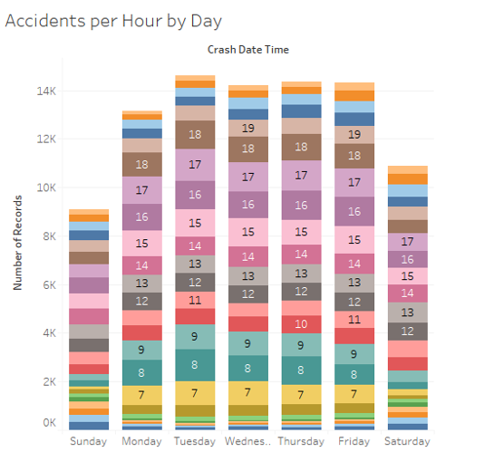
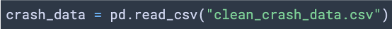
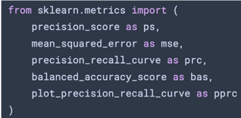

# Final-Project
  
### Team Members: 

Omar Haddad, Nithin Sunil, Sedra Kurdi, Myles Bridges

# Crashing into Machine Learning

### Predicting Vehicle Accident Blame 
Predicting the probability of the driver being at fault in a car crash given driver, weather, and road conditions.

### Questions:
1. How do we use machine learning algorithms to model our data?
2. What are the most predictive variables of a driver being at fault?
2. How predictive is the model? 

### Dataset Used: 
 https://data.world/montgomery-county-of-maryland/0ca5b758-c60a-40c7-bfb5-fda26ceee4c8

### Breakdown of Tasks:

1. Get dataset from sources.
2. Cleaned data.
3. Breakdown and analyze the dataset.
4. Predicting Crash Outcomes with ML

## Data Cleaning
###### Technology Used:
R with Regex, Tidyverse, Readr, and Stringr

###### Renamed Columns:

###### Drop columns with too many "NA" values:

###### Remove obscure car makes:

###### Create helper functions:

###### Define patterns to search for with Regex:

#### Beautiful Regex:

###### "Checker" function at work:

###### String replacement:

###### Before Cleaning:

###### After Cleaning:

## Exploratory Data Analysis

###### Most Common Accidents:

###### Avg. Speed Limit vs. Injury Severity:

###### Most common car makes:

###### Time Analysis:

###### Fatal & Serious Injuries per Vehicle Make

###### Vehicle Damage by Speed Limit

## Predicting Crash Outcomes

### First Model: Linear SVC Model

#### Predicting Crash Outcomes: Driver at Fault?

###### Import Dependencies & Data

###### Simplify Columns

###### Define X

###### Define Y

###### Train/Test Split

##### Modeling and Metrics

###### Precision-Recall Curve

###### Train Model

###### Model Metrics

###### Accuracy, Precision, Balanced Accuracy, & MSE

# Questions - Answered

###### 1. Where is crime concentrated in Austin? 

* Downtown has the largest concentration of crime with 8075 reports.
* Crime reports in each zip code do not correlate to population density, as there are certain zip code with a low population but a high number of crime reports, or vice versa.
* There is a high intensity of crime rate per 100,000 people in Downtown and East Austin (78701, 78702, 78703), showing that most crimes occur in this area.

###### 2. Is there a correlation between housing prices and crime rate? 

* Overall, population and median home cost in Austin increased between 2011 and 2016.
* There appears to be similarities in the rate of increase for both population and median home cost.
* Overall, crime decreased across most of the Austin zip codes.
* There is no visible relationship between the crime and the median home cost.

###### 3. Which type of crime is prominent in each zip code? 

* The most common violent crime by zip code is Aggravated Assault.
* The most common non-violent crime by zip code is Theft.
* Exemplary of national statistics that not all sexual assault cases are reported, out of a population of 950,715, only 1,140 cases of Sexual Assault were reported in 2018.
* We extrapolated a few zip codes and noted that there was 254 instances theft in 78613, which is Cedar Park, a zip code spanning Williamson County with a population of over 48,000 people. Given that we have calculated a 14% correlation between population size and crime rate, it stands to reason that population density has no real effect on the amount of crime occurring in a given area. 

###### 4. Does population influence the crime rate in a zip code?

* There is a weak positive (14%) correlation between population and crime rates. 
* Zip codes that are zoned with a lot of commercial areas tend to have low populations with higher reports of crime. 

## Conclusions

Based on the data we have found: 
* There is no visible relationship between the crime and the median home cost, making it difficult to track neighborhood desirability based solely on property value changes. Despite gentrification in some areas such as  78702--with property values rising to over $200,000 in 2016--the amount of crime in that area remains roughly unchanged since 2016, with 629,616 crime reports filed in 2018.
* To avoid crime the best place to live would be away from Downtown Austin because the most crime concentration is in Downtown.
* While population and median home cost in Austin increased between 2011 and 2016 the crime rate decreased across most of the Austin zip codes.
* Population is not a good indicator of crime because many crimes are committed in commercial areas where not as many people live. 
* More investigation needed to determine what might affect the crime rate.

## Disclaimer 
This is not real safety & security advice, it is only based on the data and the results analyzed from the Austin crime data sample from 2011 - 2016.
