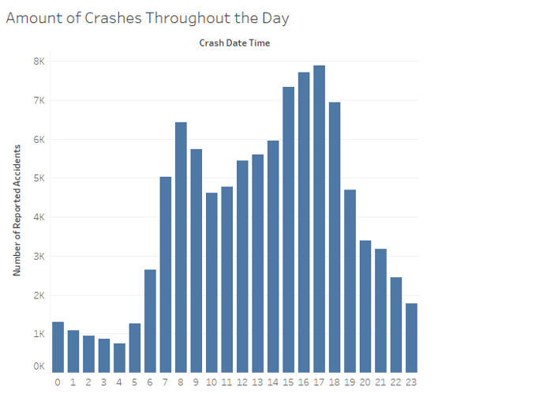
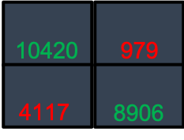

# Final-Project
  
### Team Members: 

Omar Haddad, Nithin Sunil, Sedra Kurdi, Myles Bridges

# Crashing into Machine Learning

### Predicting Vehicle Accident Blame 
Predicting the probability of the driver being at fault in a car crash given driver, weather, and road conditions.

### Questions:
1. How do we use machine learning algorithms to model our data?
2. What are the most predictive variables of a driver being at fault?
2. How predictive is the model? 

### Dataset Used: 
 https://data.world/montgomery-county-of-maryland/0ca5b758-c60a-40c7-bfb5-fda26ceee4c8

### Breakdown of Tasks:

1. Get dataset from sources.
2. Cleaned data.
3. Breakdown and analyze the dataset.
4. Predicting Crash Outcomes with ML

## Data Cleaning
###### Technology Used:
R with Regex, Tidyverse, Readr, and Stringr

###### Renamed Columns:

###### Drop columns with too many "NA" values:

###### Remove obscure car makes:

###### Create helper functions:

###### Define patterns to search for with Regex:

#### Beautiful Regex:

###### "Checker" function at work:

###### String replacement:

###### Before Cleaning:

###### After Cleaning:

## Exploratory Data Analysis

###### Most Common Accidents:

###### Avg. Speed Limit vs. Injury Severity:

###### Most common car makes:

###### Time Analysis:

###### Fatal & Serious Injuries per Vehicle Make

###### Vehicle Damage by Speed Limit

## Predicting Crash Outcomes

### First Model: Linear SVC Model

#### Predicting Crash Outcomes: Driver at Fault?

###### Import Dependencies & Data:

###### Simplify Columns:

###### Define X:

###### Define Y

###### Train/Test Split:

##### Modeling and Metrics:

###### Precision-Recall Curve:

###### Train Model:

###### Model Metrics:

###### Accuracy, Precision, Balanced Accuracy, & MSE:

###### Confusion Matrix:

### Second Algorithm

###### Reasoning:
Utilized Logistic regression because "driver_at_fault" is **Categorical**

###### Approach:
1.) Created Dummy Variables for each categorical feature
2.) Balanced data using **Synthetic Minority Oversampling** in order to have
    equal amounts of "at fault" and "not at fault"
3.) Used **Recursive Feature Elimination** for variable selection
4.) Fit features into Logistic Regression Model

###### Feature and Model Breakdown:

###### Accuracy:

###### Precision, Recall, and F1 Score:

###### ROC Curve:

